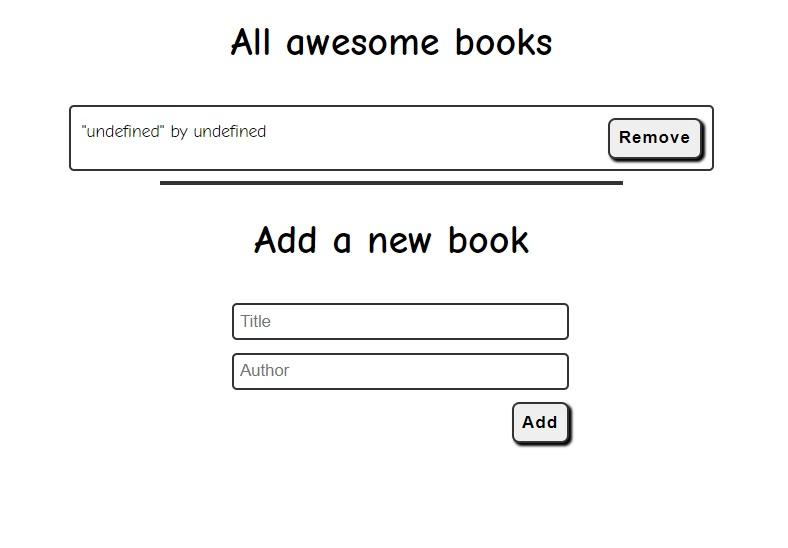

# Awesome Books

In this project, we will build a basic website that allows users to add/remove books from a list. we will achieve that by using JavaScript objects and arrays. We will also dynamically modify the DOM and add basic events. 

Additional description about the project and its features.

## Built With

- Major languages:
  - HTML
  - CSS
  - JavaScript
  - GIT
  - 
- Technologies used:
  - VScode
  - GitHub
## Live Demo

[Live Demo Link](https://sergiogval.github.io/awesome-books/)

## Getting Started

To get a local copy up and running follow these simple example steps.

### Setup
- Use the green "Code" button at the top of the repo
- Open a terminal or a git bash in the desired directory and run git@github.com:sergiogval/awesome-books.git
- Alternatively, use GitHub Desktop to clone the repository locally or
- Download this repository's zip file to your machine
- When you double click on your index.html file, it should open in the browser

## Authors

👤 **Shay Craig**

- GitHub: [@craigs40](https://github.com/craigs40)
<!-- - Twitter: [@twitterhandle](https://twitter.com/twitterhandle)
- LinkedIn: [LinkedIn](https://linkedin.com/in/linkedinhandle) -->

👤 **Sergio Valadez**

- GitHub: [@sergiogval](https://github.com/sergiogval)
- Twitter: [@srgvldz](https://twitter.com/srgvldz)
- LinkedIn: [LinkedIn](https://www.linkedin.com/in/sergio-valadez-282153216/)
- Instagram: [@sergioval](https://www.instagram.com/sergioval/)

## 🤝 Contributing

Contributions, issues, and feature requests are welcome!

Feel free to check the [issues page](https://github.com/sergiogval/awesome-books/issues).

## Show your support

Give a ⭐️ if you like this project!

## Acknowledgments

- Hat tip to anyone whose code was used
- Inspiration
- etc

## 📝 License

This project is [MIT](./MIT.md) licensed.
